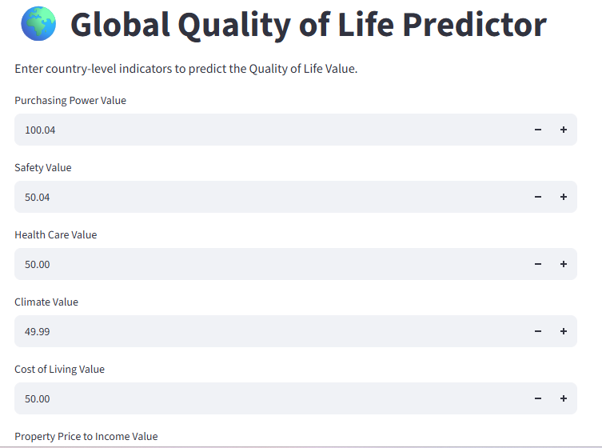
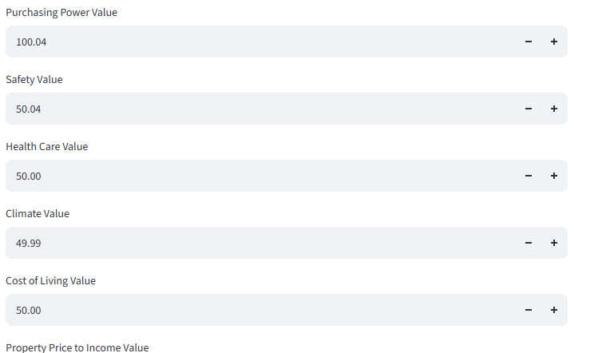
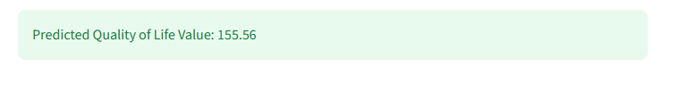

# 🌍 Global Quality of Life Predictor

[](https://global-quality-of-life-predictor001.streamlit.app/)


## 🌐 Live Application

**Try the deployed application here:**

👉 **https://global-quality-of-life-predictor001.streamlit.app/**

No installation is required. Simply open the link in your browser and begin predicting Quality of Life scores using the interactive web application.

---

# 📖 Project Overview

The **Global Quality of Life Predictor** is an end-to-end Machine Learning project that predicts a country's **Quality of Life Value** using socioeconomic indicators collected from international datasets.

The project demonstrates the complete Machine Learning workflow, including:

- Data Cleaning
- Exploratory Data Analysis (EDA)
- Feature Engineering
- Machine Learning Model Development
- Model Evaluation
- Explainable AI (SHAP)
- Principal Component Analysis (PCA)
- K-Means Clustering
- Interactive Streamlit Web Application
- Cloud Deployment

This project showcases practical Data Science skills from raw data analysis to deploying a production-ready Machine Learning application.

---

# 🎯 Business Problem

Quality of life is influenced by multiple socioeconomic indicators including purchasing power, healthcare quality, safety, pollution, climate, and living costs.

This project aims to estimate a country's Quality of Life score using Machine Learning to assist:

- Researchers
- Policy Makers
- International Organizations
- Students
- Data Scientists

---

# 📊 Dataset

The dataset used in this project is publicly available.

**Source:** global Quality of Life  Dataset (Kaggle)

🔗 https://www.kaggle.com/datasets/...


The dataset contains global Quality of Life indicators for countries around the world.

### Features Used

- Purchasing Power Value
- Safety Value
- Health Care Value
- Climate Value
- Cost of Living Value
- Property Price to Income Value
- Traffic Commute Time Value
- Pollution Value

### Target Variable

- Quality of Life Value

---

# 🛠 Technologies Used

- Python
- Pandas
- NumPy
- Scikit-Learn
- XGBoost
- SHAP
- Matplotlib
- Seaborn
- Streamlit
- Skops
- Git
- GitHub

---

# 🤖 Machine Learning Models

Three regression models were developed and compared.

| Model | Purpose |
|---------|----------|
| Linear Regression | Baseline Model |
| Random Forest Regressor | Ensemble Learning |
| XGBoost Regressor | Gradient Boosting |

---

# 📈 Model Performance

| Model | R² Score |
|--------|---------:|
| Linear Regression | 0.57 |
| Random Forest | 0.82 |
| XGBoost | 0.79 |

### Best Model

✅ **Random Forest Regressor**

Selected because it achieved the highest prediction accuracy.

---

# 🔍 Explainable AI

Model interpretability was performed using:

- SHAP Summary Plot
- Feature Importance Analysis

Most influential features included:

- Purchasing Power
- Climate
- Pollution
- Safety
- Healthcare

---

# 📊 Exploratory Data Analysis

The project includes visualizations such as:

- Correlation Heatmap
- Feature Importance
- Model Comparison
- PCA Visualization
- K-Means Clustering
- SHAP Summary Plot

---

# 📸 Application Screenshots

## Home Page



---

## User Input



---

## Prediction Result



---

## Example Prediction


---

# 🚀 Running the Project Locally

Clone the repository

```bash
git clone https://github.com/YOUR_USERNAME/global-quality-of-life-predictor.git
```

Move into the project

```bash
cd global-quality-of-life-predictor
```

Install dependencies

```bash
pip install -r requirements.txt
```

Run Streamlit

```bash
streamlit run app.py
```

---

# 📂 Project Structure

```
global-quality-of-life-predictor/
│
├── images/
│   ├── home_page.png
│   ├── input_form.png
│   ├── prediction_result.png
│   └── example_prediction.png
│
├── models/
│   └── quality_of_life_model.skops
│
├── app.py
├── requirements.txt
├── README.md
└── Quality_of_Life.csv
```

---

# 💡 Future Improvements

- Deep Learning model comparison
- Hyperparameter Optimization
- API Deployment using FastAPI
- Docker Containerization
- AWS Deployment
- Real-time data integration
- Interactive dashboards with Plotly

---

# 👩‍💻 Author

## Anita Okechukwu

Registered Midwife | Healthcare Data Analyst | Machine Learning Enthusiast

### Connect with me

- LinkedIn: *(Add your LinkedIn URL)*
- GitHub: *(Add your GitHub Profile URL)*

---

# ⭐ Support

If you found this project useful, please consider giving it a ⭐ on GitHub.

It helps others discover the project and supports my Data Science journey.
